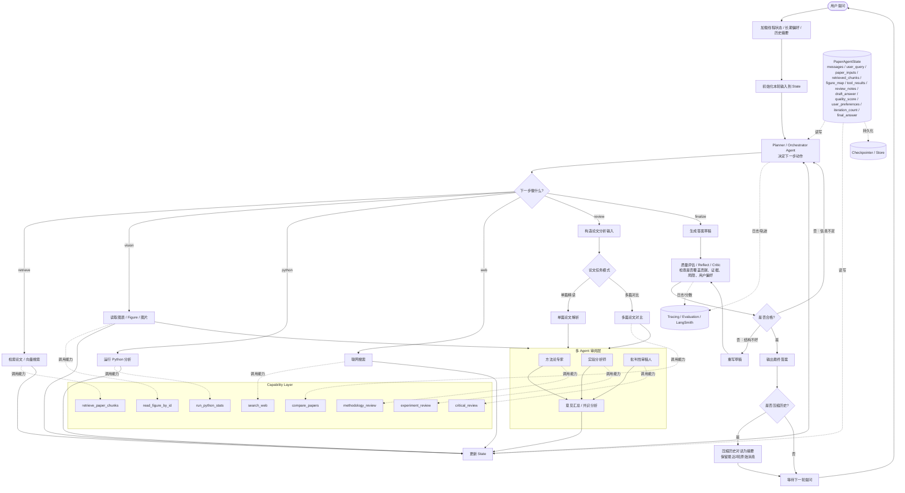

多 Agent 论文精读助手需求文档
==================

**项目名称：** Multi-Agent Paper Reading Assistant  
**项目代号：** PaperMind  
**版本：** v1.0  
**文档类型：** 产品需求文档 + 技术需求说明  
**适用场景：** 简历项目 / 毕设 / AI Agent 工程实践 / 面试项目讲解

> 该需求文档由GPT-5.4生成

* * *

1\. 项目背景
========

随着大模型能力提升，单一 Agent 已经可以完成基础问答和总结任务，但在复杂任务场景下，单 Agent 往往存在以下问题：

1.  任务过于复杂，单次推理链条长，容易遗漏信息
2.  不同子任务需要不同“专业角色”处理，如元数据提取、方法总结、公式解释、参考文献梳理
3.  输出结构不稳定，可解释性弱，难以工程化扩展
4.  面对长篇论文时，容易出现上下文溢出、重点丢失、解释粒度不一致等问题

* * *

2\. 项目目标
========

